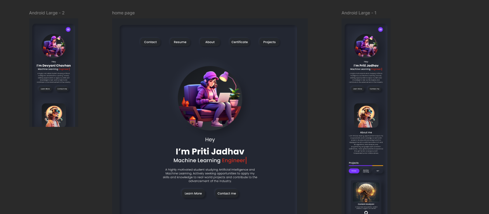

# Portfólio LangePage

Bem-vindo ao projeto de Portfólio LangePage! Este é um projeto que visa criar uma LangePage inicial para todos os colaboradores, permitindo que eles personalizem seus portfólios individuais com imagens geradas por IA, mantendo o mesmo estilo das fotos fornecidas no Figma.

## Objetivo

O objetivo principal deste projeto é criar uma LangePage padrão que servirá como um portfólio inicial para todos os colaboradores. Posteriormente, cada colaborador poderá editar sua própria LangePage, adicionando imagens geradas por IA que mantenham o mesmo estilo visual das fotos fornecidas no Figma.

## Estrutura do Projeto

O projeto está estruturado da seguinte forma:

- **docs:** Este diretório contém a documentação do projeto.
- **src:** Este diretório contém o código-fonte do projeto.
- **data:** Este diretório contém os dados necessários para treinar os modelos de IA, se aplicável.

## Ferramentas Utilizadas

- **Figma:** Utilizamos o Figma para criar o design visual do portfólio inicial e como referência para o estilo das imagens.
- Utilize o [link do portfólio no Figma](https://www.figma.com/) para acessar o design padrão e as referências visuais.

  - !Imagem do Portfólio do Figma
  
- **Inteligência Artificial:** Utilizamos ferramentas de IA para gerar imagens que sigam o estilo visual do Figma.

## Como Contribuir

Se você deseja contribuir para o projeto, siga estes passos:

1. Faça um fork deste repositório.
2. Clone o repositório forkado para a sua máquina local.
3. Crie uma nova branch para suas alterações: `git checkout -b minha-feature`.
4. Faça as alterações necessárias e adicione-as ao staging: `git add .`.
5. Faça um commit das suas alterações: `git commit -m "Adiciona minha feature"`.
6. Envie suas alterações para o repositório remoto: `git push origin minha-feature`.
7. Abra um pull request para que suas alterações sejam revisadas e mescladas à branch principal.

## Contato

Se você tiver alguma dúvida ou precisar de ajuda, não hesite em entrar em contato com o Discord através do link 

Vamos criar algo incrível juntos!
